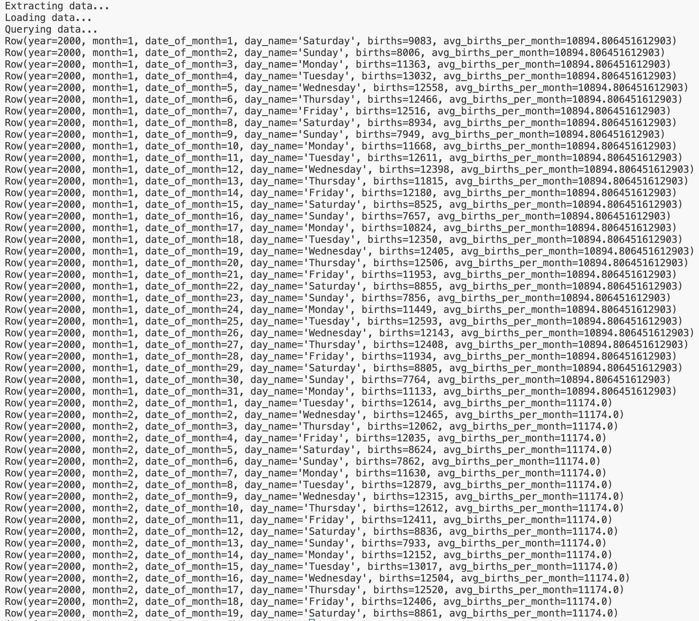

# Leo Chen Mini 6

[](https://github.com/nogibjj/Leo_Chen_Mini_6/actions/workflows/cicd.yml)

## File Structure
```
Leo_Chen_Mini_6/
├── .devcontainer/
│   ├── devcontainer.json
│   └── Dockerfile
├── .github/
│   └── workflows/cicd.yml
├── .gitignore
├── expected_output.png
├── data/
│   └── US_births.csv
├── Dockerfile
├── LICENSE
├── main.py
├── Makefile
├── mylib/
│   ├── extract.py
│   ├── query.py
│   └── transform_load.py
├── README.md
├── requirements.txt
├── setup.sh
└── test_lib.py
```

## Purpose
Design a complex SQL query involving joins, aggregation, and sorting

## Data Source
U.S. births data for the years 2000 to 2014, as provided by the Social Security Administration

Header | Definition
---|---------
`year` | Year
`month` | Month
`date_of_month` | Day number of the month
`day_of_week` | Day of week, where 1 is Monday and 7 is Sunday
`births` | Number of births

[Link to data source](https://github.com/fivethirtyeight/data/blob/master/births/US_births_2000-2014_SSA.csv)

## Query Explanation
*See the query inside `mylib/query.py`*

- **CTE (Common Table Expression)**: The `WITH monthly_avg` block calculates the average number of births per month by year and month, using data from the `US_Births_yc687` table. It groups the data by `year` and `month`, and then computes the average number of births (`avg_births_per_month`).

- **Main Query**: 
  - Selects the year, month, and date of the month for each record from the `US_Births_yc687` table.
  - Uses a `CASE` statement to convert the numeric `day_of_week` (1–7) into the corresponding day name (Monday–Sunday).
  - Retrieves the number of births for that specific day (`b.births`).
  - Joins the `monthly_avg` table on `year` and `month` to include the average births per month (`m.avg_births_per_month`).
  
- **Sorting and Limiting**: The results are ordered by `year`, `month`, and `date_of_month`, showing the first 50 records.

The output will show:
- `year`, `month`, and `date_of_month` (for each day).
- The name of the day (e.g., Monday).
- The number of births on that particular day.
- The average number of births for that entire month.
The output is limited to the first 50 records and sorted chronologically.

## Expected Output
